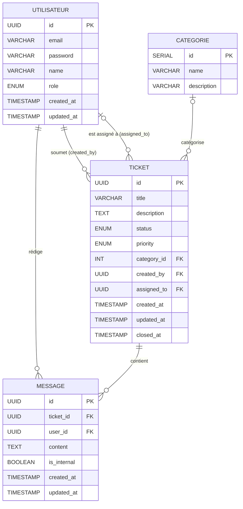

# Modèle Conceptuel de Données (MCD) — Support Master

---

## Diagramme MCD



---

## Représentation Merise

```
┌─────────────────────┐                     ┌──────────────────┐
│    UTILISATEUR      │                     │    CATEGORIE     │
├─────────────────────┤                     ├──────────────────┤
│ # id                │                     │ # id             │
│   email             │                     │   name           │
│   password          │                     │   description    │
│   name              │                     └────────┬─────────┘
│   role              │                              │
│   created_at        │                            (0,N)
│   updated_at        │                              │
└──────┬──────────────┘                       CATEGORISER
       │                                            │
     (1,N)   (0,N)                               (0,1)
       │       │                                    │
   SOUMETTRE  ASSIGNER     ┌─────────────────────────────────────────────┐
       │       │           │               TICKET                        │
     (1,1)   (0,1)         ├─────────────────────────────────────────────┤
       │       │           │ # id                                        │
       └───┬───┘           │   title                                     │
           │               │   description                               │
           └───────────────►   status (open / in_progress / resolved / closed)
                           │   priority (low / medium / high / urgent)   │
                           │   created_at                                │
                           │   updated_at                                │
                           │   closed_at                                 │
                           └──────────────────────┬──────────────────────┘
                                                  │
                                                (0,N)
                                                  │
                                              CONTENIR
                                                  │
                                                (1,1)
                                                  │
                           ┌──────────────────────▼──────────────────────┐
                           │                MESSAGE                       │
                           ├─────────────────────────────────────────────┤
                           │ # id                                        │
                           │   content                                   │
                           │   is_internal                               │
                           │   created_at                                │
                           │   updated_at                                │
                           └──────────────────────┬──────────────────────┘
                                                  │
                                                (1,1)
                                                  │
                                              REDIGER
                                                  │
                                                (1,N)
                                                  │
                                           UTILISATEUR
```

---

## Cardinalités

| Association | Entité A | Cardinalité A | Cardinalité B | Entité B |
|-------------|----------|---------------|---------------|----------|
| SOUMETTRE | UTILISATEUR | (1,N) | (1,1) | TICKET |
| ASSIGNER | UTILISATEUR | (0,N) | (0,1) | TICKET |
| REDIGER | UTILISATEUR | (1,N) | (1,1) | MESSAGE |
| CONTENIR | TICKET | (0,N) | (1,1) | MESSAGE |
| CATEGORISER | CATEGORIE | (0,N) | (0,1) | TICKET |

**Lecture :**
- Un UTILISATEUR soumet entre 1 et N tickets ; un TICKET est soumis par exactement 1 utilisateur.
- Un UTILISATEUR peut être assigné à 0 ou N tickets ; un TICKET peut avoir 0 ou 1 agent assigné.
- Un UTILISATEUR rédige 1 à N messages ; un MESSAGE est rédigé par exactement 1 utilisateur.
- Un TICKET contient 0 à N messages ; un MESSAGE appartient à exactement 1 ticket.
- Une CATEGORIE regroupe 0 à N tickets ; un TICKET appartient à 0 ou 1 catégorie.

---

## Types énumérés

| Type | Valeurs |
|------|---------|
| `user_role` | `admin`, `agent`, `client` |
| `ticket_status` | `open`, `in_progress`, `resolved`, `closed` |
| `ticket_priority` | `low`, `medium`, `high`, `urgent` |
